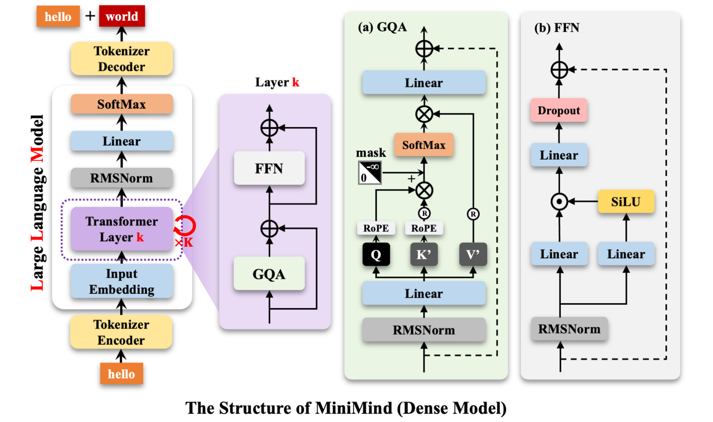

> ctrl + shift + v 预览（vscode）

### Python
#### nn.Module
1. nn.Module是所有神经网路模块的基类
   - 无论是简单的线性层Linear、卷积层Conv2d、还是整个Transformer模型，本质上都是`nn.Module`的子类。
2. nn.Module核心作用：
   - 调用 model.parameter()时，它能把所有层里的参数都找出来交给优化器；
   - 提供了统一的钩子（Hooks），方便在训练时切换模式（如`model.train()`和`model.eval()`）；
   > 钩子是一种程序切入点，为了“偷看”或修改中间层，钩子有两种：
   >
   > ==Forward Hook==：数据正着走（从输入到输出）时触发，用于想看中间层的特征图，或者提取中间结果；
   >
   > ==Backward Hook==：数据倒着走（算误差、更新参数）时触发，用于想调试梯度，看为什么模型不收敛。
   - PyTorch 的反向传播机制依赖于`nn.Module`建立的计算图连接。
3. 标准结构：两步走
   - `__init__`（构造函数-买零件）：定义需要的层（如 nn.Linear）；
   - `forward`（前向传播-组装零件）：定义数据进入模型后，需要经过的运算；
   - absolutely 除了以上两个函数，你可以定义任何你需要的。

==Module子类==

```python
import torch.nn as nn

class MyNet(nn.Module):
    def __init__(self):
        super().__init__()  # 必须调用父类初始化
        # 定义两个全连接层
        self.fc1 = nn.Linear(10, 5)
        self.fc2 = nn.Linear(5, 2)

    def forward(self, x):
        # 定义数据流向
        x = self.fc1(x)
        x = self.fc2(x)
        return x
```

==钩子hooks==
```python
# 定义一个动作
def my_hook_action(module, input, output):
    print(f"我看了一眼，这一层的输出大小是: {output.shape}")

# 找一个位置（想看第几层）并把钩子挂上去
target_layer = model.fc1 
target_layer.register_forward_hook(my_hook_action)

# 正常运行模型，运行到 fc1 层时，会自动触发上面的 print 动作
model(input_data)  
```

### Minimind
#### 架构


#### RMSNorm

> 归一化：按照统一比例缩放到 0-1 之间（或者在1上下浮动）的数，方便计算

​      $$\text{RMSNorm}(x) = \frac{x}{\sqrt{\frac{1}{N}\sum x_i^2 + \epsilon}} \times w$$

##### Code

```python
class RMSNorm(nn.Module):

    def __init__(self, dim, eps=1e-5):  # dim输入维度、eps极小值
        super().__init__()  # 必须
        self.eps=eps
        self.weight=nn.Parameter(torch.ones(dim))  
        # nn.Parameter告诉pytorch这是一个可学习参数，训练时请自动更新

    def _norm(self, x):
        return x * torch.rsqrt(x.pow(2).mean(-1, keepdim=True) + self.eps)  
    # .mean(-1, keepdim=True) 沿着最后一个维度（也就是特征维度）求平均值
    # keepdim=True 防止求平均后发生干瘪变形
    # + self.eps 加上极小安全值，防止分母为0
    # torch.rsqrt(...) 先开平方，再求倒数
    # x * ... 将原始输入x乘这个倒数，完成归一化
        
    def forward(self, x):
        return self.weight * self._norm(x.float()).type_as(x)
    # x.float() 转换成 float32 类型防止溢出
    # type_as(x) 变回和原先x一样的数据类型
```

1. `self.xxx = xxx`的目的：把这个变量存到类的“肚子”里，方便这个类里的其他函数拿出来用，这个操作在`__init__`函数中完成；

2. 如上，`_norm`函数要用到`eps`，所以就要在`init`里`self.eps=eps`，而`dim`变量只在`__init__`里用，其他函数不用，就没必要再写`self.dim = dim`了；

3. ` self.weight`是哪来的？凭空捏造？yes！还真是，python类中的变量不需要提前声明，都是直接写，直接赋值，这里假设维度`dim=3`，`nn.Parameter(torch.ones(dim))  `这个动作就是生成一个全为`1`的和`dim`维度一样的数组，作为可学习参数赋给`weight`；

4. 输入x形状`(2,3,4)` batchsize=2，len=3，特征维度=4，如下：

   ```python
   import torch
   
   # shape: (2, 3, 4)  batchsize=2 表示一批训练2句话
   x = torch.tensor([
       # ---------------- 批次 1 (第 1 句话："我爱你") ----------------
       [
           [0.1, 0.2, 0.3, 0.4],  # 序列 1：词 "我" 的 4 个特征
           [0.5, 0.6, 0.7, 0.8],  # 序列 2：词 "爱" 的 4 个特征
           [0.9, 0.8, 0.7, 0.6]   # 序列 3：词 "你" 的 4 个特征
       ],
       
       # ---------------- 批次 2 (第 2 句话："大模型") ----------------
       [
           [0.2, 0.4, 0.6, 0.8],  # 序列 1：词 "大" 的 4 个特征
           [0.1, 0.3, 0.5, 0.7],  # 序列 2：词 "模" 的 4 个特征
           [0.8, 0.6, 0.4, 0.2]   # 序列 3：词 "型" 的 4 个特征
       ]
   ])
   
   print(x.shape) # 输出: torch.Size([2, 3, 4])
   ```

   

#####  `keepdim=True` 防干瘪变形

> - 假设有一组输入数据 `x`， 2 个词，每个词 3 个特征（当然这里只是假设，本项目input不一定是这个形状），形状是 `(2, 3)`：
>
> ```sh
> x = [
>   [1.0, 2.0, 3.0],  # 第1个词的3个特征
>   [4.0, 5.0, 6.0]   # 第2个词的3个特征
> ]
> ```
>
> - 现在我们要对每行的 3 个特征求平均值 `.mean(-1)`。
>
> - 如果不写 `keepdim=True` PyTorch 算出第一行平均是 2.0，第二行是 5.0。结果会变成一个一维数组：
>
> ```sh
> mean_result = [2.0, 5.0]  # 形状变成了 (2,) ——干瘪变形
> ```
>
> 接下来，拿原来的 `x` 去和这个平均值做运算（加减乘除）， `x` 的形状是 `(2, 3)`，和一个形状是 `(2,)` 的东西运算，PyTorch 会懵逼
>
> - `keepdim=True`会强行保留原来的括号维度：
>
> ```
> mean_result = [
>   [2.0],
>   [5.0]
> ]      
> ```
>
> 当你拿 `(2, 3)` 的 `x` 和 `(2, 1)` 的 `mean_result` 运算时，PyTorch 可以横向复制（广播）3 份，对齐之后再算，于是 `mean_result` 在底层会自动变成如下形状：
>
> ```
> [
>   [2.0, 2.0, 2.0],
>   [5.0, 5.0, 5.0]
> ]
> ```
>


##### RMSNorm v.s. 平均绝对值

> RMS 的优势：对极端值/大数值更敏感，更适合衡量特征幅度，而不是简单的取平均

|            |             `[1, -1, 1, -1]`              |                ` [3, 0, 0, 0]`                 |
| :--------: | :---------------------------------------: | :--------------------------------------------: |
| 平均绝对值 |          $\frac{1+1+1+1}{4} = 1$          |           $\frac{3+0+0+0}{4} = 0.75$           |
|    RMS     | $\sqrt{\frac{1+1+1+1}{4}} = \sqrt{1} = 1$ | $\sqrt{\frac{9+0+0+0}{4}} = \sqrt{2.25} = 1.5$ |


##### w的作用

 $$\text{RMSNorm}(x) = \frac{x}{\sqrt{\frac{1}{N}\sum x_i^2 + \epsilon}} \times w$$    可学习参数 $$w$$ 的作用？例如：

- 原特征`[1, 2, 3, 4]`；
- 归一化后`[0.36, 0.73, 1.09, 1.46]`，原本较大的数值`4`被削弱成`1.46`了；
- 模型学到的 $w$ `[0.8, 0.9, 1.2, 1.5]`；
- 最总输出==归一化 $\times  w$== `[0.29, 0.66, 1.31, 2.19]`，恢复了大数值的重要性，同时整体幅度依然可控。


